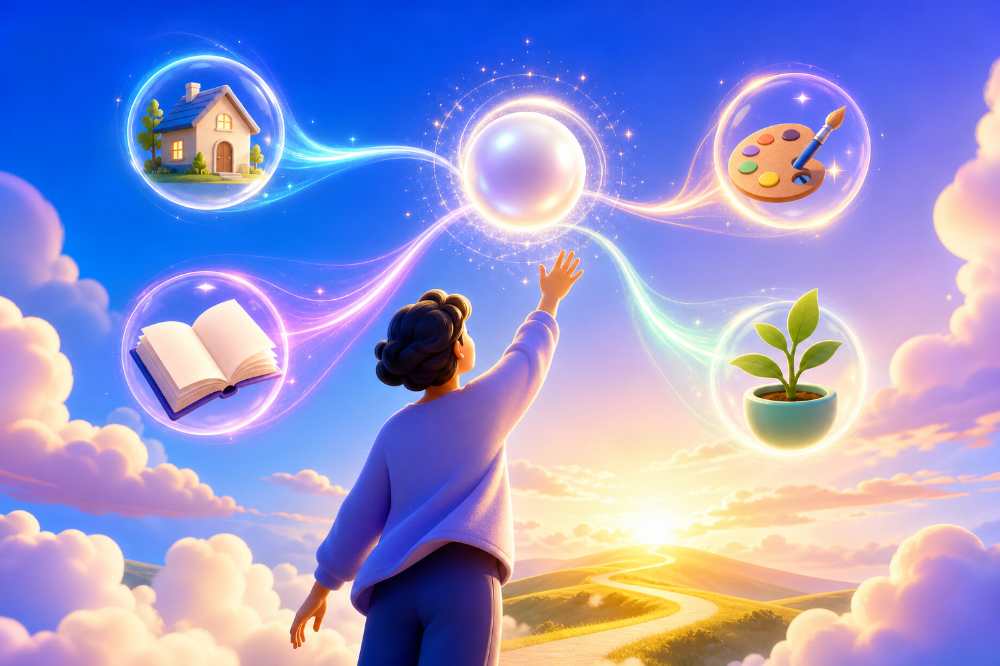
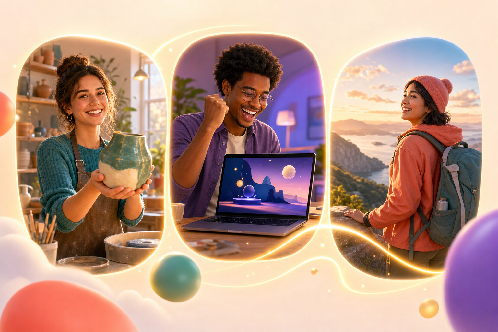
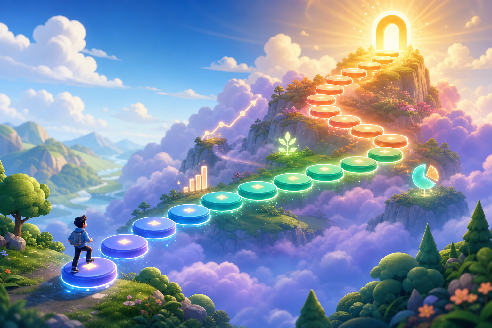

# Open Abundance Visual Language

Статус: принят как визуальный ориентир 2026-07-20.

Этот документ фиксирует стиль первых трех onboarding-иллюстраций и правила его продолжения в будущих экранах Open Abundance.

## 1. Эмоция

Интерфейс и изображения должны передавать:

- яркость, энергию и движение вперед;
- ощущение открывающихся возможностей;
- человеческое тепло, а не холодный технологический футуризм;
- амбицию без давления и демонстративной роскоши;
- понятный путь от желания к действию и результату.

Ключевая формула:

```text
желание -> светящийся маршрут -> последовательные шаги -> достижимая вершина
```

## 2. Основной стиль иллюстраций

- Premium polished 3D editorial illustration.
- Округлые, тактильные формы и чистые силуэты.
- Современная эстетика mobile fintech + wellbeing.
- Свет рассвета, сияние, воздушная перспектива и ощущение простора.
- Один главный сюжет, понятный даже в небольшой карточке.
- Люди остаются главным субъектом; ИИ показан как помощник, маршрут или светящийся Core.
- Визуальные метафоры: световые линии, путь, полет, ступени, рост, соединение возможностей.

Избегать темного sci-fi, киберпанка, экранов с псевдокодом, роботов-господ, криптовалютной эстетики, куч наличных и образов недоступной роскоши.

## 3. Палитра

Основные цвета продолжают интерфейс приложения:

| Роль | Цвет | Смысл |
|---|---:|---|
| Электрический синий | `#0a84ff` | скорость, технология, ясность |
| Ультрафиолет | `#675dff` | воображение, ИИ, новые возможности |
| Свежий зеленый | `#34c759` | рост, жизнь, подтвержденный прогресс |
| Коралловый | `#ff6b6b` | энергия, человек, действие |
| Теплое золото | `#ffbd4a` | цель, награда, вершина |
| Глубокий сине-зеленый | `#082d3f` | устойчивость и контраст |

Фон может переходить от синего и фиолетового у старта к зеленому и золотому у результата. Цвет не должен выглядеть кислотным или игровым казино.

### Интерфейсные палитры

Реализованный выбор цвета интерфейса сохраняет одну визуальную систему и меняет оттенок фона, поверхностей и основного действия. Доступны серый (исходный), синий, зелёный, фиолетовый, янтарный и бирюзовый варианты; каждый работает со светлой, тёмной и системной темой. Выбор хранится локально и применяется до первого рендера, чтобы при запуске не возникала вспышка другой палитры.

Навигационный знак Core — семя с ростком внутри защитного кольца. Кольцо означает неотчуждаемую основу, семя — сохраняемый капитал, росток — рост и будущий урожай. Знак используется вместо архитектурной иконки банка.

## 4. Композиция и технические правила

- Базовый формат onboarding-изображения: landscape `3:2`, сейчас `1536x1024`.
- Главный субъект и важные элементы должны оставаться внутри центральной safe area с запасом под crop.
- Изображение должно читаться при ширине карточки около `340-560 px`.
- Не помещать в растр слова, буквы, числа, валютные символы, логотипы и watermark.
- Все заголовки, суммы и подписи выводятся интерфейсом как HTML-текст.
- Для frontend использовать `next/image`, информативный `alt`, `object-fit: cover` и отдельную проверку мобильного crop.
- Не генерировать декоративную картинку, если смысл можно яснее выразить существующей иллюстрацией или интерфейсом.
- Новый asset сохранять в проекте под смысловым стабильным именем; варианты получают суффиксы `-v2`, `-v3`.

## 5. Люди и результаты

- Показывать разных людей в естественных ситуациях, без одинаковых рекламных лиц.
- Результат должен быть понятен визуально: созданный предмет, запущенный проект, освоенный навык, поездка, улучшение дома, помощь другим.
- Радость должна выглядеть живой, а не постановочной.
- Не изображать гарантированный доход, мгновенное богатство, дорогие автомобили, яхты, пачки денег или культ статуса.
- Демо-история и подтвержденный пользовательский результат должны сохранять существующую семантическую маркировку в интерфейсе; иллюстрация не заменяет статус достоверности.

## 6. Принятые эталоны

### ИИ превращает желания в маршрут



Файл: `public/onboarding/ai-abundance-path.png`.

Эталон для миссии, AI Coordinator, первого желания и сцен, где несколько возможностей собираются в один маршрут.

### Истории людей



Файл: `public/onboarding/people-stories.png`.

Эталон человеческого тепла, разнообразия целей и понятных результатов без образов роскоши.

### Двадцать уровней



Файл: `public/onboarding/twenty-levels.png`.

Эталон для Core-прогресса, карты роста, новых возможностей и движения к большой цели.

## 7. Базовый prompt template

```text
Use case: stylized-concept
Asset type: <where the illustration is used>
Primary request: <one clear visual idea tied to a user action or result>
Scene/backdrop: <open, luminous environment>
Subject: <human subject and one primary metaphor>
Style/medium: premium polished 3D editorial illustration, human and warm,
modern mobile fintech/wellbeing aesthetic, tactile rounded forms
Composition/framing: 3:2 landscape, simple strong silhouette,
generous safe margins, readable at small size, suitable for a rounded mobile card
Lighting/mood: bright sunrise energy, optimistic, exciting, inviting
Color palette: electric blue, ultraviolet, fresh emerald, coral and warm gold
Constraints: no words, no letters, no numbers, no currency symbols,
no logos, no watermark; no dark dystopian sci-fi; no piles of cash;
keep the scene uncluttered and instantly readable at small size
```

## 8. Исходные prompts эталонных изображений

Изображения созданы встроенным ImageGen в режиме `stylized-concept`.

### `ai-abundance-path.png`

```text
Use case: stylized-concept
Asset type: first screen illustration for a mobile app onboarding card
Primary request: a hopeful visual metaphor for an AI abundance system turning a person's wish into an achievable path
Scene/backdrop: luminous open sky blending from deep electric blue through violet to warm sunrise gold
Subject: one gender-neutral young adult seen from a gentle three-quarter back angle, reaching toward a radiant pearl-like AI core; flowing ribbons of light connect the core to several clear opportunity symbols such as a small home, creative tool, learning book, and growing plant
Style/medium: premium polished 3D editorial illustration, human and warm, modern mobile fintech/wellbeing aesthetic, tactile rounded forms
Composition/framing: 3:2 landscape, central subject with generous safe margins, simple strong silhouette, suitable for cropping inside a rounded mobile card
Lighting/mood: bright sunrise energy, optimistic, exciting, inviting
Color palette: electric blue, ultraviolet, fresh emerald, coral and warm gold on a clean light atmosphere
Constraints: no words, no letters, no numbers, no currency symbols, no logos, no watermark; avoid dark dystopian sci-fi; keep the scene uncluttered and instantly readable at small size
```

### `people-stories.png`

```text
Use case: stylized-concept
Asset type: second screen illustration for a mobile app onboarding card
Primary request: a joyful visual about real people achieving meaningful personal goals with a helpful intelligent system
Scene/backdrop: one cohesive bright scene arranged as three connected rounded story windows floating in warm light
Subject: three distinct adults in natural celebratory moments: one proudly holding a finished handmade product in a small creative studio, one opening a laptop to see a successful independent project, one arriving at a beautiful travel viewpoint with a backpack; subtle luminous pathways connect all three stories
Style/medium: premium polished 3D editorial illustration, friendly believable people, modern mobile product campaign, tactile rounded forms
Composition/framing: 3:2 landscape, balanced triptych-like composition with faces and results readable at small size, generous safe margins, suitable for cropping inside a rounded card
Lighting/mood: lively, warm, authentic joy, confidence and momentum
Color palette: electric blue, violet, fresh emerald, coral and sunny gold, harmonious with the first illustration
Constraints: no words, no letters, no numbers, no currency symbols, no logos, no watermark; avoid exaggerated luxury, piles of cash, corporate stock-photo poses, clutter, or identical faces
```

### `twenty-levels.png`

```text
Use case: stylized-concept
Asset type: third screen illustration for a mobile app onboarding card
Primary request: an exhilarating visual metaphor for a twenty-level journey toward a life-changing financial milestone
Scene/backdrop: radiant sky world rising from green foothills through violet clouds to a brilliant golden summit
Subject: a clearly countable path of exactly twenty distinct glowing stepping stones or floating rounded platforms ascending toward one luminous summit portal; a tiny confident traveler starts on the first platform; subtle reward sparks and growth symbols appear along the route
Style/medium: premium polished 3D editorial illustration, playful game-map energy, modern mobile fintech/wellbeing aesthetic, tactile rounded forms
Composition/framing: 3:2 landscape, sweeping S-curve path, all twenty platforms visible and visually separated, strong depth, generous safe margins, suitable for cropping inside a rounded mobile card
Lighting/mood: energetic, ambitious, joyful, achievable rather than intimidating
Color palette: electric blue and ultraviolet at the base, fresh emerald in the middle, coral highlights, warm gold at the summit; harmonious with the two previous onboarding illustrations
Constraints: exactly twenty platforms; no words, no letters, no numbers, no dollar signs, no currency symbols, no logos, no watermark; no piles of cash, no dark mood, no clutter
```

## 9. Checklist для нового изображения

- Смысл понятен без подписи?
- В центре человек, его действие или результат?
- Есть ощущение маршрута, роста или открывающейся возможности?
- Изображение сочетается с тремя эталонами по свету, формам и палитре?
- Нет текста, логотипов, денег и обещания мгновенного богатства?
- Главные детали переживают мобильный crop?
- Для изображения добавлен локализованный `alt`?
- Финальный asset сохранен внутри workspace и подключен через `next/image`?

## 10. Реализовано: социальные поверхности (2026-07-25)

- Основная навигация использует full-width edge-to-edge glass без внешних скруглений: полупрозрачный фон, blur, тонкий световой кант и safe-area отступы.
- Желания, общая лента и блоги используют плотную трёхколоночную медиа-сетку с пропорцией `4:5`, заголовком поверх градиента и минимальными зазорами.
- Полный текст, автор, ссылки, медиа и доступные действия остаются в detail modal, чтобы сетка не превращалась в нечитаемый список.
- Челленджи и проекты используют grouped-list с тонкими разделителями вместо набора тяжёлых карточек.
